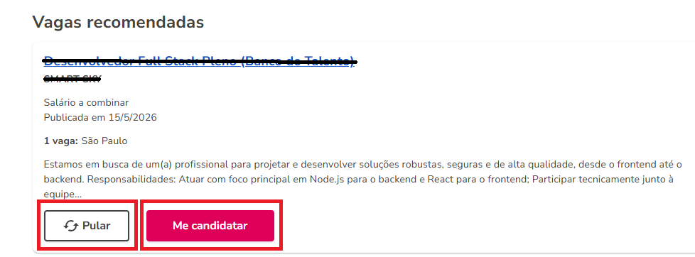

# Catho Job Application Bot

Este é um bot de automação para enviar currículos no site da Catho (https://www.catho.com.br) usando reconhecimento de imagem via PyAutoGUI.



## ⚠️ Aviso Importante

Este bot foi criado para fins educacionais e de demonstração de automação. O uso de bots para se candidatar a vagas pode violar os termos de serviço do Catho e de outros sites de emprego. Use por sua conta e risco.

## 📋 Funcionalidades

O bot realiza as seguintes ações automaticamente:

1. **Navegação na área do candidato**: Assume que o usuário já está logado no Catho e na página de vagas recomendadas.
2. **Detecção de botões via imagem**: Usa capturas de tela de botões específicos para localizá-los na tela.
3. **Tratamento de respostas obrigatórias**: Quando o Catho exibe uma tela com perguntas obrigatórias antes de permitir o envio do currículo, o bot:
   - Pressiona `ESC` para fechar o pop-up de perguntas
   - Clica no botão "Pular" para ignorar a vaga
4. **Filtragem de empresas específicas**: Pula automaticamente vagas da empresa "BAIRESDEV" (configurável via imagem).
5. **Loop contínuo**: Continua se candidatando a vagas até ser interrompido pelo usuário (Ctrl+C).

## 🛠️ Como Funciona

O bot utiliza o seguinte fluxo:

1. **Inicialização**: Aguarda 5 segundos para que o usuário mude para o navegador com o Catho aberto.
2. **Loop principal** (para cada candidatura):
   - Verifica e fecha qualquer popup de confirmação bloqueante ("Agora não")
   - Verifica se há a imagem da BAIRESDEV (se sim, pula a vaga)
   - Tenta clicar no botão "Me Candidatar" (rosa)
   - Após clicar em "Me Candidatar":
     - Tenta clicar diretamente em "Enviar meu currículo"
     - Se encontrar, verifica se há tela de resposta obrigatória:
       - Se sim: pressiona `ESC` → clica em "Pular" → vaga pulada
       - Se não: clica em "Agora não" (confirmação) → currículo enviado
     - Se não encontrar "Enviar meu currículo":
       - Pressiona `ESC` para fechar possíveis popups de perguntas
       - Tenta clicar em "Pular"
       - Após pular, tenta novamente clicar em "Enviar meu currículo" (com timeout maior)
       - Se sucesso: trata resposta obrigatória como acima
       - Se falha: continua para próxima vaga

## 📁 Estrutura do Projeto

```
Catho bot/
├── catho_automation.py    # Script principal de automação
├── BAIRESDEV.png          # Imagem de referência para detectar vagas da BAIRESDEV
├── candidatar.png         # Imagem do botão "Me Candidatar"
├── enviar_curriculo.png   # Imagem do botão "Enviar meu currículo"
├── pular.png              # Imagem do botão "Pular"
├── agora_nao.png          # Imagem do botão "Agora não"
└── resposta_obrigatorio.png # Imagem da tela de resposta obrigatória
```

## 🔧 Pré-requisitos

1. **Python 3.8** instalado
2. **Bibliotecas Python necessárias**:
   ```bash
   pip install pyautogui
   ```
3. **Imagens de referência**: 
   - As imagem de referente já estão no codigo mas caso enfrente problema no reconhecimento faça suas proprias capturas, o codigo já te orienta qual nomeclatura usar, qualquer coisa pede pro chatgpt te falar amigo 

## ▶️ Como Usar

1. **Prepare o ambiente**:
   - Abra seu navegador e acesse https://www.catho.com.br/area-candidato/
   - Faça login e navegue até a página de vagas recomendadas ou similares onde os botões "Me Candidatar" sejam visíveis.
   - Posicione a janela do navegador de forma que não seja coberta por outras janelas durante a execução.

2. **Execute o script**:
   ```bash
   python catho_automation.py
   ```

3. **Aguarde a contagem regressiva**:
   - O bot aguarda 5 segundos para você mudar para o navegador (apenas na primeira execução do loop).

4. **Interrompa quando desejar**:
   - Pressione `Ctrl+C` no terminal para parar o bot a qualquer momento.

## 🎯 Dicas para Melhor desempenho

- **Qualidade das imagens**: Capture as imagens com boa resolução e iluminação consistente com o site e seu navegador.
- **Confiança (confidence)**: Ajuste a variável `CONFIDENCE` no início do script se o bot estiver tendo dificuldade para encontrar os botões (valor entre 0.0 e 1.0).
- **Timeouts**: Ajuste os valores de `TIMEOUT`, `POST_CLICK_WAIT` e `ESC_WAIT` se necessário, dependendo da velocidade da sua conexão e do carregamento do site.
- **Evite interferências**: Não mova o mouse ou use o teclado enquanto o bot estiver executando, pois isso pode interromper a automação.

## 📝 Personalização

- Para alterar a empresa que é automaticamente pulada, substitua a imagem `BAIRESDEV.png` por uma imagem característica da empresa que deseja filtrar (ou modifique a lógica na linha 114).
- Os tempos de espera podem ser ajustados nas constantes no topo do script:
  - `CONFIDENCE`: Nível de confiança para reconhecimento de imagem (padrão: 0.8)
  - `TIMEOUT`: Tempo máximo em segundos para aguardar um elemento (padrão: 10)
  - `POST_CLICK_WAIT`: Tempo de espera após um clique (padrão: 0.5)
  - `ESC_WAIT`: Tempo de espera após pressionar ESC (padrão: 0.5)

## ❌ Limitações

- Dependente da interface visual do Catho: se o site mudar o layout ou a aparência dos botões, o bot deixará de funcionar até que as imagens sejam atualizadas.
- Requer que o navegador esteja em primeiro plano e não seja sobreposto por outras janelas durante a execução.
- Não lida com captchas ou outras medidas de segurança que possam aparecer.
- O uso em larga escala pode ser detectado como comportamento não humano pelo site.

## ⚖️ Considerações Éticas e Legais

Este bot é fornecido apenas como exemplo técnico. O usuário é responsável por:
- Cumprir os termos de serviço do Catho e de quaisquer outros sites onde o bot seja usado.
- Respeitar os limites de taxa de candidatura estabelecidos pelos sites.
- Não usar o bot para fins maliciosos, spam ou violação de privacidade.
- Entender que o envio automático de currículos pode ser considerado práticas desleais em alguns contextos.

## 💡 Diferenciais Técnicos (Por que não usei Selenium?)

Ótima pergunta! 😄

Durante o desenvolvimento deste projeto, optei por utilizar PyAutoGUI em vez de Selenium. O principal motivo foi que eu queria praticar minha lógica de automação e explorar melhor as possibilidades da biblioteca, já que esse era um dos meus objetivos de aprendizado no momento.

Reconheço que, para automação web, o Selenium provavelmente seria uma escolha mais robusta e escalável. Ainda assim, decidi seguir com o PyAutoGUI para ganhar experiência prática e entender seus desafios e limitações na prática.

Quem sabe em uma próxima versão eu não faça uma migração para Selenium? 😅
